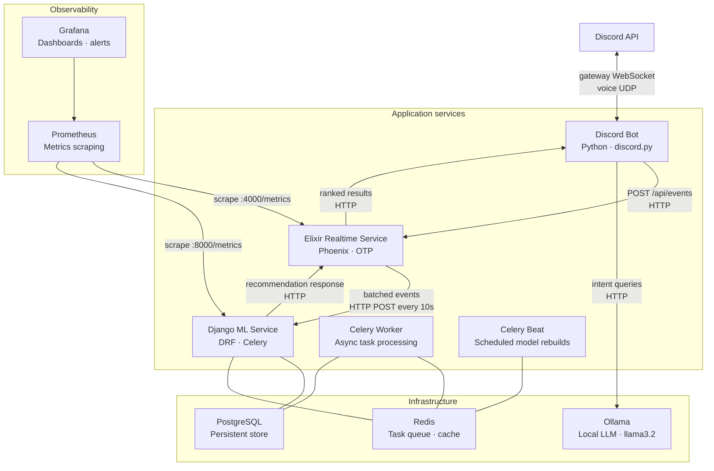
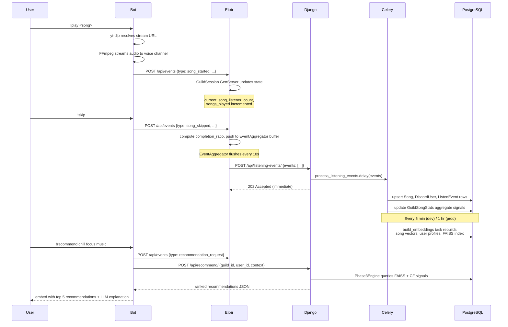
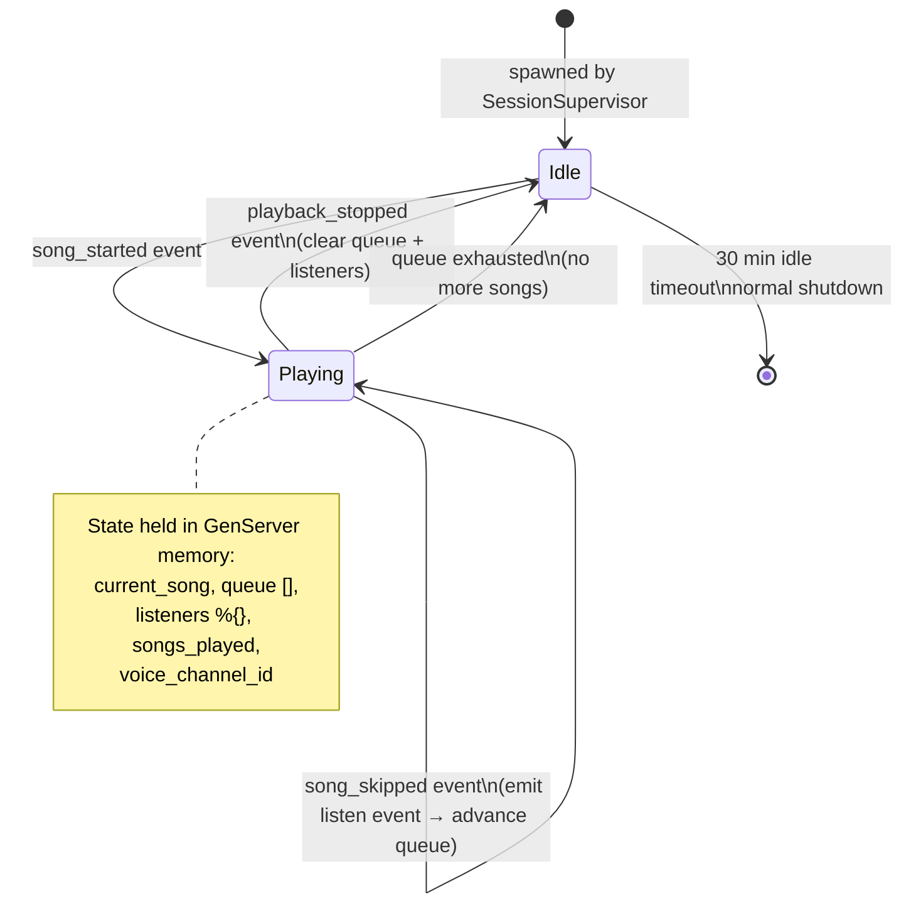
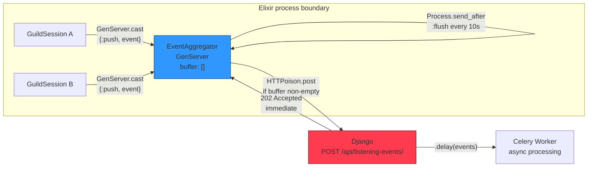
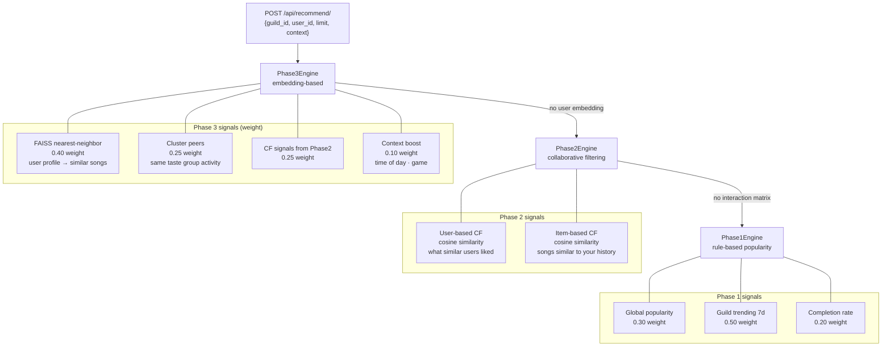
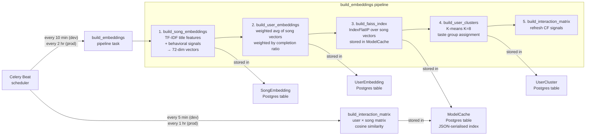
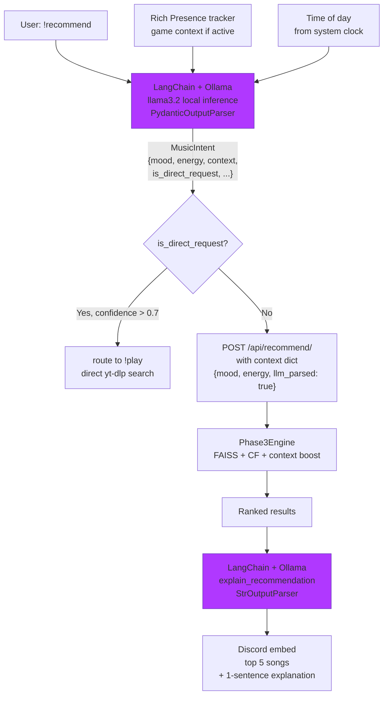
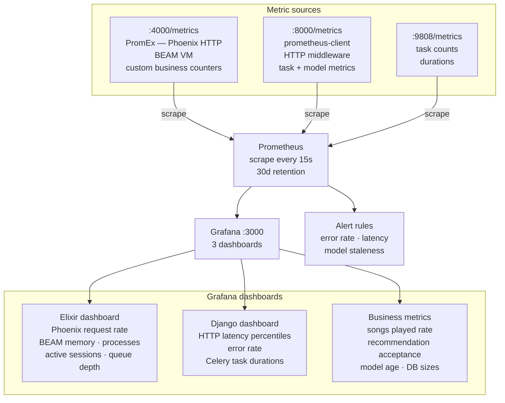
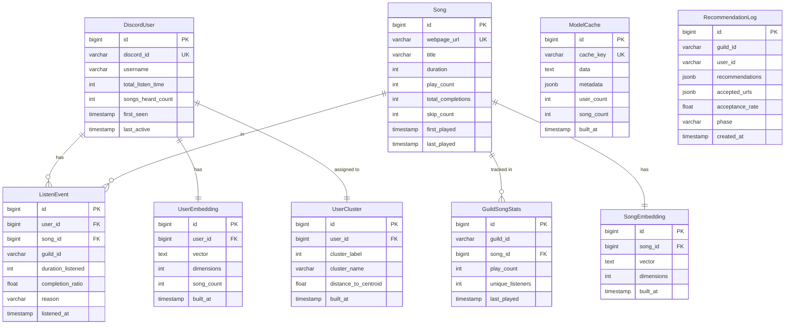

## System architecture

Full architecture of the Discord music bot. Each section covers a different layer or component with diagrams showing both structure and data flow.

---

### 1. System overview

Four application services and three infrastructure services. All services run in Docker.

---

### 2. Data flow: song play to recommendation

Primary data flow: a user requests a song, listening event travels through the system, eventually improves future recommendations.

---

### 3. Elixir OTP supervision tree

Every process in the Elixir service is supervised. The tree defines what starts, in what order, and what happens when something crashes.

```mermaid
graph TD
    App["ElixirService.Application\nOTP Application root"]

    App --> PubSub["Phoenix.PubSub\nInternal event fan-out"]
    App --> Registry["Registry\n:unique — guild_id → PID"]
    App --> SessionSup["SessionSupervisor\nDynamicSupervisor"]
    App --> Aggregator["EventAggregator\nGenServer · 10s flush timer"]
    App --> Endpoint["Phoenix Endpoint\nHTTP + PromEx /metrics"]

    SessionSup -->|"spawned on first event\nfrom that guild"| GuildA["GuildSession\nGenServer — guild A"]
    SessionSup --> GuildB["GuildSession\nGenServer — guild B"]
    SessionSup --> GuildN["GuildSession\nGenServer — guild N"]

    GuildA --> UserA1["UserSession\nGenServer — user 1 in guild A"]
    GuildA --> UserA2["UserSession\nGenServer — user 2 in guild A"]

    style App fill:#4A4A4A,stroke:#999
    style SessionSup fill:#20C743,stroke:#28a745
    style Aggregator fill:#20C743,stroke:#28a745
    style GuildA fill:#1A7AD6,stroke:#004085
    style GuildB fill:#1A7AD6,stroke:#004085
    style GuildN fill:#A8AAB3,stroke:#6c757d
    style UserA1 fill:#E3B619,stroke:#856404
    style UserA2 fill:#E3B619,stroke:#856404
```

**Supervision strategies:**
- `Application` supervisor: `:one_for_one` -> crashed child restarts independently
- `SessionSupervisor`: `DynamicSupervisor` -> guild sessions created and removed at runtime
- `GuildSession`: self-terminates via `:timeout` after 30 minutes of inactivity
- `UserSession`: self-terminates via `:timeout` after 60 minutes of inactivity

---

### 4. GuildSession state machine

`GuildSession` GenServer transitions through states based on incoming Discord events.

---

### 5. Event aggregation pipeline

`EventAggregator` is a single GenServer that prevents the bot's realtime path from coupling to Django's availability.

**Failure behavior:** If the Django POST fails then the buffer is retained and retried on the next flush cycle. Events are never lost within a session lifetime. If Elixir crashes then buffered events not yet flushed are lost. This is an acceptable tradeoff before eventually adding a persistent queue via RabbitMQ/Kafka.

---

### 6. ML recommendation pipeline

Three recommendation phases are available. The system uses the most advanced phase for which sufficient data exists, falling back automatically.

---

### 7. ML model build pipeline (Celery Beat)

Model data is rebuilt periodically by scheduled Celery tasks. The pipeline runs in dependency order: embeddings must exist before the FAISS index can be built.

---

### 8. LLM intent parsing

LLM is a translation layer only. It converts natural language into structured context that the existing recommendation pipeline consumes.

**Failure modes:** If Ollama is unavailable or the parse fails, `extract_intent` returns `MusicIntent(is_direct_request=True, raw_query=original_query, confidence=0.0)`. The bot treats the message as a direct song search. LLM failure is never surfaced to the user.

---

### 9. Observability stack

**Key metrics by service:**

| Service | Metric                                                        | Type      | Purpose                    |
| ------- | ------------------------------------------------------------- | --------- | -------------------------- |
| Elixir  | `elixir_service_songs_started_total`                          | Counter   | Songs played per guild     |
| Elixir  | `elixir_service_guild_sessions_active`                        | Gauge     | Live session count         |
| Elixir  | `elixir_service_event_aggregator_flush_duration_milliseconds` | Histogram | Flush latency              |
| Django  | `django_recommendation_duration_seconds`                      | Histogram | Recommendation p95 latency |
| Django  | `ml_recommendations_served_total`                             | Counter   | Requests by phase          |
| Django  | `django_model_last_built_timestamp_seconds`                   | Gauge     | Model staleness            |
| Django  | `ml_listen_events_processed_total`                            | Counter   | Ingestion throughput       |

---

### 10. Database schema

